# BookLeaf Customer Query Bot

A take-home build of a customer-query bot for a book publisher.
Authors ask questions in natural language; the bot routes them to a
Supabase author database, falls back to RAG over a markdown knowledge
base, scores its own confidence, escalates to a human when uncertain,
and logs every interaction.

A second deliverable — **Identity Unification** — lives in
[`identity_unification/`](identity_unification/) and links one author's
multiple platform identities into a single profile.

---

## 1. Architecture

```mermaid
flowchart LR
    U[Author<br/>CLI / Streamlit / Email / WhatsApp / Instagram] --> CL[Classifier<br/>LangChain<br/>ChatGoogleGenerativeAI<br/>+ with_structured_output Pydantic]
    CL -->|intent, target,<br/>extracted email/title| OR[Orchestrator<br/>src/responder.py]

    OR -->|target=db / both| DB[(Supabase<br/>authors table)]
    OR -->|target=kb / low DB conf| KB[FAISS vector store<br/>GoogleGenerativeAIEmbeddings<br/>persisted to data/kb_faiss]

    DB -->|0 / 1 / many rows| OR
    KB -->|top-k chunks + scores| OR

    OR --> GEN[Answer LCEL chain<br/>ChatPromptTemplate &#124; ChatGoogleGenerativeAI &#124; StrOutputParser]
    GEN --> CONF{final_confidence<br/>>= 0.80?}
    CONF -- yes --> R[Reply to user]
    CONF -- no  --> ESC[Escalate<br/>logs/human_queue.jsonl]
    ESC --> R

    R --> LOG[Logger<br/>logs/queries.jsonl<br/>+ Supabase query_logs]
```



Why this shape: classify first so we know whether to even hit the DB,
and so we can pull useful entities (email, book title) out of free
text. Generation runs after retrieval so the model only ever writes
things it can ground.

---

## 2. Setup

Requires **Python 3.10+**.

```bash
# 1. install deps
pip install -r requirements.txt

# 2. configure secrets
cp .env.example .env
# edit .env and fill in: LLM_API_KEY, SUPABASE_URL, SUPABASE_KEY

# 3. (one-time) provision the Supabase tables — see section 4
```

### LLM provider — Gemini free tier via LangChain

The bot uses **LangChain** for all AI work:
- `ChatGoogleGenerativeAI.with_structured_output(Pydantic)` for the classifier
- `GoogleGenerativeAIEmbeddings` + **FAISS** for RAG retrieval
- `ChatPromptTemplate | ChatGoogleGenerativeAI | StrOutputParser` (an LCEL
  chain) for grounded answer generation

The Gemini API key comes from `LLM_API_KEY`. Get a free key at
https://aistudio.google.com/apikey.

**To switch providers / models**: change `CHAT_MODEL` and `EMBED_MODEL`
in `.env`. To use a non-Gemini chat model you'd swap
`ChatGoogleGenerativeAI` for another `langchain-*` integration in
`src/classifier.py` and `src/responder.py` — LangChain's interfaces make
this a few-line change because the surrounding LCEL chain stays the same.

### Required env vars

| Var | What it is |
|-----|------------|
| `LLM_API_KEY` | Required. Gemini API key. |
| `CHAT_MODEL` | Default `gemini-2.5-flash-lite` — pick a model with enough free-tier RPD for your testing. |
| `EMBED_MODEL` | Default `gemini-embedding-001`. |
| `SUPABASE_URL` | Your Supabase project URL (with or without `/rest/v1/` — the loader normalizes it). |
| `SUPABASE_KEY` | Supabase service-role or anon key with read/write on the two tables. |
| `ESCALATION_THRESHOLD` | optional, default `0.80`. |

**Switching embedding models invalidates the FAISS cache automatically** —
`data/kb_meta.json` records the embed model + source-file fingerprint,
and the loader rebuilds `data/kb_faiss/` if anything changed.

---

## 3. Running it

```bash
# Interactive chat (the main interface)
python -m src.chat

# Scripted demo — every branch of the pipeline, end to end
python -m src.chat --demo

# Show intent / source / confidence / escalated under each reply
python -m src.chat --debug

# Simulate a different channel for logging
python -m src.chat --channel whatsapp

# Optional Streamlit web UI (same pipeline)
streamlit run app.py

# Identity unification demo
python -m identity_unification.unify
```

---

## 4. Supabase schema

These tables already exist in the assignment Supabase. They're
reproduced here for reference / reviewer use.

```sql
-- authors: mock author records the bot looks things up in
create table if not exists authors (
  id                     bigserial primary key,
  email                  text unique not null,
  book_title             text not null,
  final_submission_date  date,
  book_live_date         date,
  royalty_status         text,
  isbn                   text,
  add_on_services        text     -- comma-separated for the demo
);

-- query_logs: every interaction the bot has, mirrored from the local jsonl
create table if not exists query_logs (
  id              bigserial primary key,
  created_at      timestamptz not null default now(),
  channel         text,
  user_query      text,
  matched_email   text,
  intent          text,
  confidence      numeric,
  response        text,
  escalated       boolean default false
);

-- Sample data the demo expects:
insert into authors (email, book_title, final_submission_date, book_live_date, royalty_status, isbn, add_on_services) values
  ('sara.johnson@xyz.com', 'Whispers of the Monsoon',  '2025-01-15', '2025-03-14', 'paid',       '978-93-12345-01-7', 'promo_video, bookmarks_pack'),
  ('amit.verma@gmail.com', 'The Last Tea Stall',       '2025-02-20',  null,        'pending',    '978-93-12345-02-4', 'author_interview'),
  ('priya.nair@outlook.com', 'Songs from Fort Kochi',  '2024-12-05', '2025-02-01', 'processing', '978-93-12345-03-1', 'press_release, promo_video');
```

---

## 5. Design decisions

- **LangChain as the AI framework.** The classifier uses
  `with_structured_output(Pydantic)` so we get schema-validated JSON
  without writing a parser; the answer step is a tiny LCEL chain
  (`prompt | llm | parser`); RAG is a real `FAISS` vector store. This
  keeps the code idiomatic — swapping providers or chaining in a
  reranker is a few-line change.
- **FAISS vector store, persisted on disk.** Re-embedding the KB on
  every startup wastes free-tier quota. FAISS's `save_local` /
  `load_local` is the LangChain-idiomatic way to make startup cheap.
  Falls back to `InMemoryVectorStore` if `faiss-cpu` isn't available.
- **Classifier returns a structured target.** Instead of letting the
  generator decide what to retrieve, the classifier explicitly emits
  `target ∈ {db, knowledge_base, both, unknown}`. That makes the
  retrieval step deterministic and testable.
- **Generation is grounded-only.** The answer prompt forbids the model
  from inventing facts and tells it to admit ignorance. The KB and DB
  record are passed in as plain text the model reads — there is no
  "open-domain" path.
- **File logging is the source of truth.** Supabase logging is
  best-effort and wrapped in `try/except` that swallows. If Supabase
  is down, the local `logs/queries.jsonl` still has every interaction.
- **Conservative embedding batching.** Gemini's free tier rate-limits
  per-request, so we embed in batches of 10 with a 7-second pause and
  honor any `retryDelay` the API returns on a 429.

---

## 6. Confidence & escalation logic

Three signals are combined into a single `final_confidence` in
[`src/responder.py`](src/responder.py):

| Signal | Source | Range |
|--------|--------|-------|
| `llm_confidence` | Classifier's self-rating | 0–1 |
| `db_confidence` | `1.0` exact email hit, `~0.7` fuzzy title hit, `0.0` no hit | 0–1 |
| `kb_confidence` | Top cosine similarity from RAG search | 0–1 |

```text
grounding       = max(db_confidence, kb_confidence)
final_confidence = 0.4 * llm_confidence + 0.6 * grounding
if both DB and KB hit:           final += 0.05  (capped at 1.0)
if classifier said target=unknown: final = min(final, 0.4)
```

Why this shape: grounding matters more than the classifier's
self-rating (so "I'm sure I don't know" can't masquerade as confidence),
and corroboration from both sources earns a small bonus.

**Escalation**: if `final_confidence < 0.80`, the bot returns its
tentative answer plus a handoff line and writes a record to
`logs/human_queue.jsonl`. The threshold is configurable via
`ESCALATION_THRESHOLD`.

---

## 7. Error-handling matrix

| Situation | What the bot does |
|-----------|-------------------|
| **DB unreachable** (transport error, bad creds) | Apologize, escalate with reason `db_unavailable`. Never crashes. |
| **No DB match** for a personal-info query | Ask the user for their registered email or book title. Confidence ≈ 0.4. |
| **Multiple DB matches** (fuzzy title hit several rows) | List the candidate titles and ask which one. Confidence 0.5. |
| **Empty / missing KB file** | Warn at startup, RAG returns `[]`, bot still answers DB-backed queries. |
| **Classifier returns invalid JSON** | One retry with stricter prompt; then fall back to `other/unknown`. |
| **Vague query** (e.g. "uhh what about the thing") | classified `unknown` → final confidence capped at 0.4 → escalation. |
| **Answer generation API call fails** | Escalate with reason `generation_failed`. |
| **Log write fails** (disk full, etc.) | Swallowed. Never breaks the user reply. |

---

## 8. What I'd improve with more time

- **Auth on the chat surface.** Right now the bot trusts the email in
  the message text. In prod, the channel itself would identify the
  author (WhatsApp number, dashboard session, etc.) and we'd never
  trust user-supplied identifiers for sensitive info.
- **Streaming responses.** The CLI waits for the full answer. Streaming
  tokens via the Responses API would feel snappier.
- **Channel adapters as separate modules.** `--channel` is a label
  today; a real implementation would have `channels/whatsapp.py`,
  `channels/email.py` etc. with their own delivery + intake.
- **A small eval harness.** Take ~30 labelled queries, run them through
  the pipeline nightly, track precision/recall on intent classification
  and confidence calibration, alert when escalation rate drifts.
- **Caching the classifier per session.** Same author asking 3 follow-ups
  shouldn't re-classify their email each time.
- **Embedding-based fuzzy title match** (not just rapidfuzz) for books
  with translated/transliterated titles.
- **A tiny admin UI** that reads `logs/human_queue.jsonl` so an agent
  can actually pick the escalations up.
- **Better KB chunking** — semantic / heading-aware instead of fixed
  ~500-char windows.

---

## 9. Self-rating (1–10)

| Area | Rating | Notes |
|------|--------|-------|
| Zapier / Make / n8n comfort | _<fill>_ | _<fill>_ |
| LangChain / OpenAI SDK experience | _<fill>_ | _<fill>_ |
| System design & troubleshooting | _<fill>_ | _<fill>_ |

---

## Project layout

```
bookleaf-query-bot/
├── README.md                  ← you are here
├── requirements.txt
├── .env.example
├── app.py                     ← optional Streamlit UI
├── data/
│   └── knowledge_base.md      ← RAG source of truth
├── logs/                      ← created at runtime (gitignored)
│   ├── queries.jsonl
│   └── human_queue.jsonl
├── src/
│   ├── config.py              ← loads .env, defines paths
│   ├── db.py                  ← Supabase wrapper + custom exception
│   ├── knowledge_base.py      ← FAISS vector store + Gemini embeddings (LangChain)
│   ├── classifier.py          ← LangChain structured-output classifier (Pydantic)
│   ├── responder.py           ← orchestrator — pipeline + LCEL answer chain
│   ├── escalation.py          ← human handoff
│   ├── logger.py              ← jsonl + Supabase logging
│   └── chat.py                ← rich CLI · --demo · --debug · --channel
└── identity_unification/
    ├── README.md
    ├── flowchart.md           ← mermaid + pseudocode
    └── unify.py               ← working demo with rich table
```
