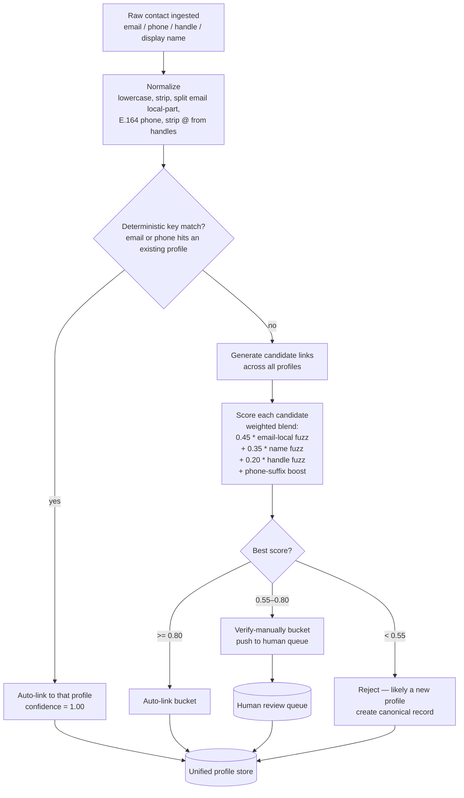

# Identity Unification — Flowchart

## Key ideas

- **Deterministic before probabilistic.** Exact email/phone hits skip
  the fuzzy step entirely — those are essentially primary keys.
- **Weighted blend of fuzzy signals.** Email local-part is the strongest
  on-platform name proxy, display name is next, social handle last.
  A matching phone-number suffix adds a small bonus.
- **Three buckets**: auto / verify / reject. The mid bucket is where
  human-in-the-loop earns its keep — we never auto-merge ambiguous
  identities.
- **Output**: every linked contact ends up in a canonical
  `unified_profile`, but ambiguous ones go through the review queue first.
